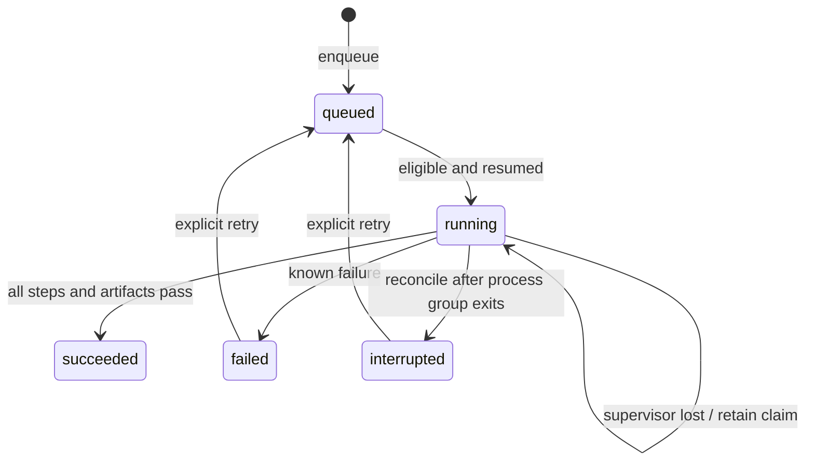

**Local experiment runner — implementation and cutover**

`packages/sepalith` is an independent, standard-library package. Its first runner
version executes whole experiments serially. That provides one managed workload
at a time, including GPU and quiet-window work. CPU parallelism and cloud dispatch
are future extensions, not implicit capabilities.

The runner does not see jobs managed by old shell chains or other queue roots.
Choose one authoritative state directory for the machine. Finish and drain the
old supervisors before activating this queue for actual experiments. A new queue
starts paused; `resume` changes dispatch eligibility but starts no process.

**State and behavior**

An experiment recipe is immutable after enqueue. Each explicit retry creates a
new attempt directory while preserving previous logs and status. Dependencies
refer to experiment IDs and unblock only after successful execution. Cycles are
rejected; a missing dependency stays visibly blocked.



Execution success means commands exited zero and declared artifacts were present,
nonempty and hashed. Later steps must preserve previously verified artifacts;
write a new output path for each version. The runner rechecks their hashes
before and after later steps. It is separate from a scientific adoption verdict. Make
scientific checks explicit steps and retain their result artifacts. The runner
does not infer whether a model is better or interpret Markdown verdicts.

`run-next` executes one eligible experiment in the foreground. `run` processes
eligible experiments until the queue is paused, no job is eligible, or an attempt
fails. It does not poll indefinitely. Run `pause` from another terminal to drain:
the current experiment continues through all its steps, then dispatch stops.
Do not combine unrelated experiments into one recipe if they need a drain point.

**Source and input identity**

`snapshot --repo PATH --include PATH ...` copies the selected Git-visible regular
files, including current uncommitted and nonignored untracked bytes. Ignored files
are not captured. Every include must match at least one Git-visible file;
a missing or ignored dependency is an error even when other includes match.
Select import dependencies, configs and build inputs as well as
the main script. Absolute paths and `..` in includes are rejected. This is not a
worktree from HEAD and does not silently discard uncommitted work.

The snapshot ID hashes paths, file contents and executable modes. The manifest
also records origin, capture time and Git HEAD for provenance. File contents are
rechecked against the working tree before publishing, but writers must still
finish a multi-file change before capture; no filesystem snapshot transaction is
claimed. Captured source is verified before enqueue and dispatch.

Each attempt gets a local source copy. Its captured files retain their original
read-only modes and are checked before and after each step. Generated files may
be written beside them; existing source cannot silently change between steps.
Use `{source}` for source paths and `{run}` for outputs. Absolute paths back to
the mutable development checkout defeat this design and must be removed from
migrated commands. This is input integrity checking, not a security sandbox.

Large datasets, checkpoints and binaries can remain external. Declare regular
file paths and SHA256 digests in `inputs`; they are verified before execution.
Use immutable external artifacts for the whole run. Hashing large inputs consumes
I/O, so it belongs inside the scheduled resource window. Directory datasets need
a separately generated manifest plus a verification step; hashing the manifest
alone does not verify every dataset shard.

**Recipe format**

```json
{
  "schema_version": 1,
  "id": "example-receipt",
  "snapshot": "REPLACE_WITH_64_CHARACTER_SNAPSHOT_ID",
  "resource": "cpu",
  "depends_on": [],
  "env": {"OMP_NUM_THREADS": "1"},
  "inputs": [],
  "provenance": {"purpose": "runner demo, not a model experiment"},
  "steps": [
    {
      "id": "receipt",
      "argv": ["{python}", "{source}/packages/sepalith/examples/write_receipt.py", "{run}/receipt.json"],
      "artifacts": ["receipt.json"]
    }
  ]
}
```

`argv` is a list passed directly to a process, without shell interpolation.
Only `{python}`, `{source}` and `{run}` are substituted. An explicit absolute
`python` field chooses a prepared environment; otherwise the runner's interpreter
is used. `env` contains non-secret overrides; credentials, if a step needs them,
come from the inherited environment. The entire inherited environment is not
stored. CPU and quiet recipes clear `CUDA_VISIBLE_DEVICES`; GPU recipes retain
the configured value. Thread limits remain explicit recipe settings.

`provenance` is user-supplied JSON, not a verified scientific comparison. Record
model/tokenizer identities, split and renderer versions, recipe deviations and
gate definitions there or in declared input manifests. A future comparison
validator can consume these records; this version does not certify matched FLOPs
or the feasibility of a proposed scientific gate.

**Commands**

From the repository root, prefix these with
`PYTHONPATH=packages/sepalith/src python3 -m sepalith.runner --state /absolute/state/path`:

| Command | Effect |
|---|---|
| `snapshot --repo /absolute/repo --include packages/sepalith/examples/write_receipt.py` | Capture the selected source and return its ID |
| `enqueue recipe.json` | Validate and persist a recipe; no process launch |
| `plan` | Report pause state, recipes, dependencies and attempts |
| `resume` | Allow future dispatch |
| `run-next` | Execute at most one experiment |
| `run` | Execute eligible experiments serially until a stop condition |
| `pause` | Prevent new experiments; finish the current one |
| `recover ATTEMPT_ID` | Mark an interrupted attempt only after its recorded process group is inactive |
| `resolve-unknown ATTEMPT_ID --audit audit.json` | Resolve an unknown launch using an explicit operator audit, while paused |
| `retry EXPERIMENT_ID` | Requeue a failed/interrupted experiment; start a fresh attempt on next dispatch |

Keep the state directory on a local filesystem supporting SQLite and `flock`,
outside the source checkout. Archive completed artifacts to the NAS separately.
`state.sqlite3` holds queue and attempt status; `snapshots/` holds source records;
`attempts/` holds recipe/runtime records, per-step logs, execution receipts and
artifact hashes. Required artifacts and JSON records are flushed before a success
transition. Storage hardware and external artifacts still determine persistence
across machine failure; this is not a backup system.

**Failure and restart rules**

A dispatcher lock prevents concurrent dispatchers for the same state directory.
A persisted unfinished attempt blocks new dispatch even after that lock is lost.
Each step runs in its own process group and is recorded before waiting. Recovery
leaves a live group untouched. Orphaned zombies cannot execute and do not hold a
resource forever. A crashed parent does not imply the workload stopped.

A crash between process creation and recording its identity leaves an unknown
launch. `recover` refuses to guess. Use `resolve-unknown` only after an operator
has established that all processes belonging to that attempt have stopped:

1. Pause the queue and inspect `plan`, the attempt's recipe, step index, logs,
   recorded worker/process-group IDs, and launch time.
2. Audit the host processes against that attempt: inspect process IDs, parent and
   group IDs, command lines, working directories, and start times as needed.
   Include any descendants that escaped the original process group. A missing
   recorded child ID, dead dispatcher, or absent log is not evidence that no
   workload exists. If identity or liveness remains uncertain, keep the queue
   paused and the attempt unresolved.
3. Save the following JSON with the actual attempt ID, operator, current audit
   timestamp, findings and captured evidence. `checked_at` requires an explicit
   timezone and must fall after the attempt started and before submission.
   Evidence must contain the relevant observations/command output, not merely
   a path to a mutable log. Exclude credentials and unrelated private data.

   ```json
   {
     "schema_version": 1,
     "attempt": "REPLACE_WITH_ATTEMPT_ID",
     "operator": "REPLACE_WITH_OPERATOR_ID",
     "decision": "interrupted",
     "checked_at": "REPLACE_WITH_ISO_TIMESTAMP_AND_TIMEZONE",
     "all_processes_stopped": true,
     "findings": "REPLACE_WITH_HOW_THIS_ATTEMPT_WAS_IDENTIFIED_AND_CLEARED",
     "evidence": "REPLACE_WITH_CAPTURED_PROCESS_AUDIT_OBSERVATIONS"
   }
   ```

4. Submit `resolve-unknown ATTEMPT_ID --audit audit.json`. Decisions are limited
   to `interrupted` or `failed`; this path cannot declare success. The command
   requires a paused queue and the dispatcher lock, and refuses a known live
   process group even if the submitted audit claims otherwise. It never kills
   processes. Review the resulting record in `plan` before any explicit `retry`
   or `resume`.

The audit is an operator attestation: the runner checks its structure and known
process-group liveness, but cannot prove the absence of an unrecorded workload or
validate the supplied observations. Submit it immediately after inspection;
there is no automatic audit-expiry window. Do not use this path to override
uncertainty or live work.

Resolution preserves the original attempt state, original recipe and complete
submitted audit in an append-only `operator_resolutions` table. SQLite commits
that record and the terminal status together; a failed transaction leaves the
claim intact. Database triggers reject changes or deletion of resolution rows.
Existing attempt files remain unchanged. `plan` exposes these records, including
after retries. This is a local audit trail, not protection against an operator
who can replace the database. Resolution leaves the queue paused and does not
retry the experiment.

There is no automatic training-checkpoint resume. Explicit retry starts from the
first step in a fresh output directory; a later recipe must explicitly consume a
verified checkpoint if resuming training is intended.

Steps must run in the foreground and keep subprocesses in their process group.
They must not use `setsid`, `nohup`, detached servers or independent background
supervisors. The runner detects surviving members of its recorded process group;
it does not contain escaped descendants in a cgroup. Audit existing wrappers for
this before migration. Launching the outer runner detached is a separate concern
and may follow the workstation's supervisor policy.

**Cutover checklist**

1. Inventory the old dispatchers and their automatic next-experiment commands.
   Finish the current experiment's evaluation, verdict and artifact mirroring.
2. Drain old dispatch; verify it cannot start another job. Existing jobs and the
   dashboard remain managed by their current owners until this step is complete.
3. Convert one next experiment to foreground steps, explicit roots, immutable
   input identities and verified outputs. Capture all required source files.
4. Inspect its `plan`, recipe, dependencies, resource class and input checks. Run
   the tiny receipt example and failure/recovery tests before any actual training.
5. Resume the new runner for that experiment. Compare receipts and artifacts with
   its preregistered expectations. Migrate the rest only after this succeeds.
6. Retain the old queue snapshot and commands for rollback. Reconcile any attempt
   already started before restoring the old dispatcher; never run both at once.

The current implementation has not performed this cutover or imported the live
Markdown queue. Its lightweight tests cover captured uncommitted source,
dependencies, explicit retries, drain behavior, child survival after dispatcher
termination, missing outputs, invalid inputs and source tampering. Real model and
cloud integration remain separate validation work.

First migration preparation and current cutover blockers are recorded in
[migration/rollback evidence](migrations/2026-09-06-first-runner.md). Fake-job
validation does not establish that the legacy dispatchers have drained.
